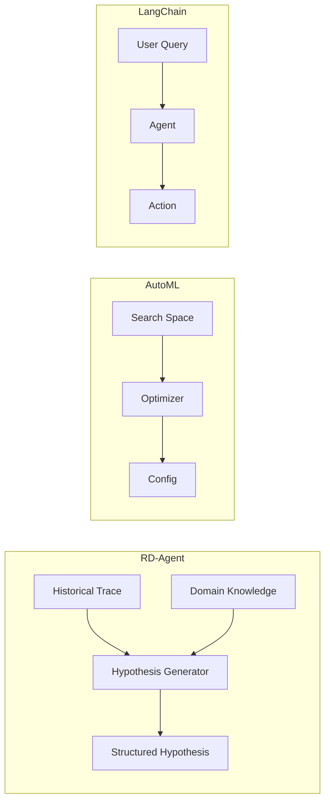
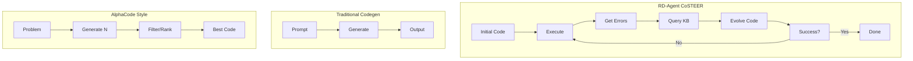
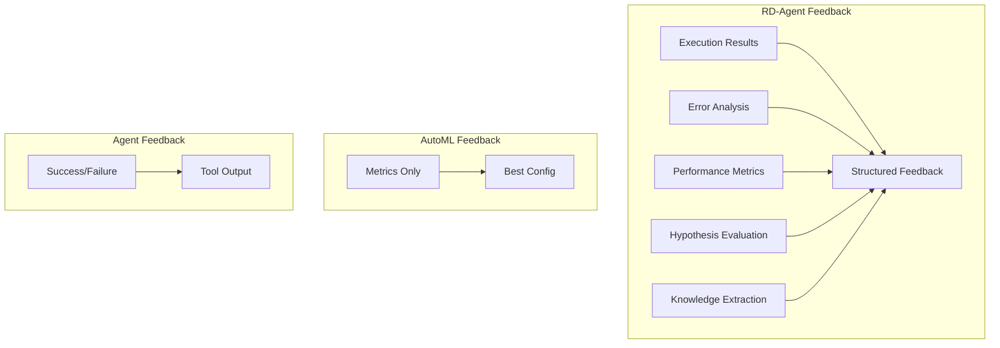
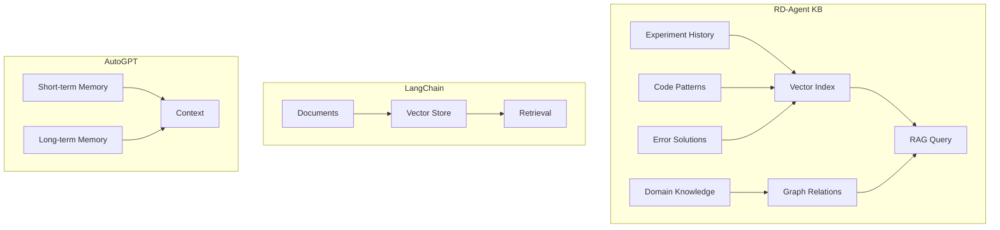
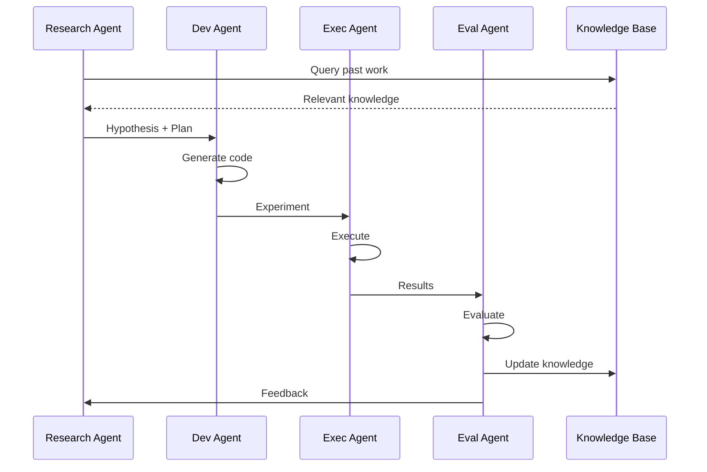

# Component Comparison with Similar Frameworks

## Overview

This document compares RD-Agent's components with similar frameworks and systems in the automated research, code generation, and AI agent spaces.

## Framework Comparison Matrix

| Feature | RD-Agent | AutoML Frameworks | LangChain Agents | AutoGPT | OpenAI Assistants | Research-specific Tools |
|---------|----------|-------------------|------------------|---------|-------------------|------------------------|
| **Hypothesis Generation** | ✅ Full support | ❌ No | ⚠️ Limited | ⚠️ Limited | ❌ No | ✅ Domain-specific |
| **Code Generation** | ✅ Multi-language | ⚠️ Config-based | ✅ Via tools | ✅ Generic | ✅ Via interpreter | ⚠️ Limited |
| **Experiment Execution** | ✅ Dockerized | ✅ Local/Cloud | ⚠️ Limited | ⚠️ Limited | ✅ Sandbox | ❌ Manual |
| **Feedback Loop** | ✅ Automated | ⚠️ Metric-based | ⚠️ Limited | ⚠️ Limited | ❌ No | ⚠️ Manual |
| **Knowledge Base** | ✅ RAG + Graph | ❌ No | ✅ Vector DB | ⚠️ Memory | ✅ Threads | ❌ No |
| **Multi-Scenario** | ✅ Yes | ⚠️ Limited | ✅ Yes | ✅ Yes | ✅ Yes | ❌ No |
| **Evolving Strategy** | ✅ CoSTEER | ❌ No | ❌ No | ❌ No | ❌ No | ⚠️ Limited |
| **Real-world Verification** | ✅ Yes | ✅ Yes | ⚠️ Limited | ⚠️ Limited | ⚠️ Limited | ⚠️ Simulated |

Legend: ✅ Full support | ⚠️ Partial support | ❌ Not supported

## Detailed Component Comparison

### 1. Hypothesis Generation & Research Loop

#### RD-Agent
```python
class HypothesisGen:
    def gen(self, trace: Trace) -> Hypothesis:
        # Uses past experiments and domain knowledge
        # Generates structured hypotheses with reasoning
        # Supports multiple generation strategies
```

**Strengths:**
- Structured hypothesis with reasoning
- Learning from historical feedback
- Domain-specific knowledge integration
- Multiple proposal strategies (naive, decomposition-based)

**Comparison:**
- **AutoML (H2O, Auto-sklearn)**: Focus on hyperparameter search, no hypothesis generation
- **LangChain Agents**: Can propose actions but not research hypotheses
- **AutoGPT**: Goal-oriented but lacks scientific hypothesis structure
- **Research Tools (Semantic Scholar, Elicit)**: Provide insights but don't generate testable hypotheses

#### Architecture Diagram


### 2. Code Generation & Implementation

#### RD-Agent - CoSTEER Strategy
```python
class CoSTEER(EvolvingStrategy):
    def evolve(self, subjects, trace, knowledge):
        # Collaborative evolving with error feedback
        # Multi-round refinement
        # Template-based + LLM generation
```

**Key Features:**
- **Error-driven evolution**: Learns from failures
- **Multi-stage refinement**: Successive improvements
- **Template integration**: Combines structure with flexibility
- **Domain-specific**: Tailored for factors/models

**Comparison Table:**

| Aspect | RD-Agent (CoSTEER) | GitHub Copilot | CodeLlama | AlphaCode | Codex |
|--------|-------------------|----------------|-----------|-----------|-------|
| **Iterative Refinement** | ✅ Multi-round with feedback | ❌ Single-shot | ❌ Single-shot | ⚠️ Multiple samples | ⚠️ Limited |
| **Error Recovery** | ✅ Automatic | ❌ Manual | ❌ Manual | ⚠️ Retry logic | ⚠️ Limited |
| **Domain Knowledge** | ✅ Integrated | ⚠️ Training data | ⚠️ Training data | ⚠️ Problem-specific | ⚠️ Training data |
| **Template Support** | ✅ Hybrid approach | ❌ No | ❌ No | ❌ No | ❌ No |
| **Knowledge Base** | ✅ RAG-enabled | ❌ No | ❌ No | ❌ No | ❌ No |

#### Evolution Strategy Comparison


### 3. Experiment Execution & Isolation

#### RD-Agent Approach
```python
# Docker-based isolated execution
class Runner(Developer):
    def develop(self, exp: Experiment) -> Experiment:
        # Execute in Docker container
        # Capture all outputs
        # Clean up resources
```

**Comparison:**

| Framework | Execution Model | Isolation | Resource Management |
|-----------|----------------|-----------|---------------------|
| **RD-Agent** | Docker containers | Full OS-level | Automatic cleanup |
| **AutoML** | Local/distributed | Process-level | Framework-managed |
| **Jupyter Kernels** | Kernel isolation | Process-level | Manual |
| **OpenAI Code Interpreter** | Sandboxed cloud | Full isolation | Cloud-managed |
| **LangChain** | Direct execution | None/Process | User-managed |
| **E2B** | Cloud containers | Full isolation | Cloud-managed |

**Advantages of RD-Agent's Approach:**
- Complete dependency isolation
- Reproducible environments
- Secure execution
- Easy cleanup
- Cross-platform consistency

### 4. Feedback & Learning Loop

#### RD-Agent Feedback System
```python
class Experiment2Feedback:
    def generate_feedback(self, exp: Experiment, trace: Trace) -> Feedback:
        # Multi-dimensional feedback
        # Hypothesis evaluation
        # Knowledge extraction
        # Decision making
```

**Feedback Structure Comparison:**



| Aspect | RD-Agent | AutoML | RL Agents | LLM Agents |
|--------|----------|--------|-----------|------------|
| **Feedback Depth** | Multi-dimensional | Metric-based | Reward signal | Success/failure |
| **Knowledge Update** | Explicit KB update | Implicit (next trial) | Policy update | Context/memory |
| **Reasoning** | Hypothesis evaluation | Statistical | Value estimation | LLM reasoning |
| **Actionability** | Structured decisions | Next config | Next action | Next prompt |

### 5. Knowledge Management

#### RD-Agent Knowledge Base
```python
class EvolvingKnowledgeBase:
    - Vector storage (embeddings)
    - Graph structure (relations)
    - RAG query mechanism
    - Incremental learning
```

**Knowledge Architecture:**



**Comparison:**

| System | Storage Type | Query Method | Learning | Domain-Specific |
|--------|-------------|--------------|----------|-----------------|
| **RD-Agent** | Vector + Graph | RAG | Incremental | ✅ Yes |
| **LangChain** | Vector DB | Similarity | Static | ⚠️ Depends |
| **AutoGPT** | File/DB | Keyword | Limited | ❌ No |
| **OpenAI Assistants** | Thread-based | Context | Session | ❌ No |
| **MemGPT** | Hierarchical | OS-like | Active | ❌ No |

### 6. Multi-Agent Coordination

#### RD-Agent Agent Types
1. **Research Agent**: Hypothesis generation
2. **Development Agent**: Code implementation  
3. **Execution Agent**: Running experiments
4. **Evaluation Agent**: Feedback generation

**Coordination Pattern:**


**Comparison with Other Multi-Agent Systems:**

| System | Agent Types | Coordination | Knowledge Sharing |
|--------|-------------|--------------|-------------------|
| **RD-Agent** | Specialized R&D roles | Pipeline + Feedback | Centralized KB |
| **AutoGen** | Flexible roles | Conversation | Message-based |
| **MetaGPT** | Software dev roles | SOP-based | Shared memory |
| **CrewAI** | Task-oriented | Sequential/Parallel | Tool-based |
| **LangGraph** | State machines | Graph-based | State-based |

## Unique Advantages of RD-Agent

### 1. **Scientific Research Focus**
Unlike general-purpose agents, RD-Agent is specifically designed for:
- Hypothesis-driven research
- Experimental validation
- Scientific knowledge accumulation
- Real-world verification

### 2. **Domain-Specific Optimization**
- Financial quantitative research
- Medical prediction
- Data science competitions
- Each with specialized components

### 3. **Evolving Code Generation (CoSTEER)**
- Error-driven evolution
- Knowledge-enhanced generation
- Multi-round refinement
- Template + LLM hybrid

### 4. **Integrated R&D Loop**
- Seamless research to development flow
- Automated experiment lifecycle
- Continuous learning from feedback
- Knowledge-driven improvement

### 5. **Production-Ready Execution**
- Docker-based isolation
- Reproducible environments
- Comprehensive error handling
- Resource management

## Areas for Improvement

### 1. **Compared to AutoML Frameworks**
- Could add more automated hyperparameter search
- Could support more ML frameworks out-of-box
- Could add neural architecture search (NAS)

### 2. **Compared to General Agents**
- Could add more general-purpose tools
- Could support broader task types
- Could add more natural language interaction

### 3. **Compared to Research Tools**
- Could add literature review automation
- Could support more research paper formats
- Could add citation management

## Use Case Mapping

| Use Case | Best Tool | RD-Agent Support |
|----------|-----------|------------------|
| **Automated Trading Strategy** | RD-Agent | ✅ Excellent |
| **Kaggle Competition** | RD-Agent + AutoML | ✅ Good |
| **Paper Implementation** | RD-Agent | ✅ Excellent |
| **General Code Generation** | Copilot/Codex | ⚠️ Limited |
| **Hyperparameter Tuning** | Optuna/Ray Tune | ⚠️ Moderate |
| **Data Analysis** | AutoML + RD-Agent | ✅ Good |
| **Web Automation** | AutoGPT/LangChain | ❌ Not supported |
| **Question Answering** | LangChain/OpenAI | ❌ Not supported |

## Conclusion

RD-Agent fills a unique niche in the AI agent ecosystem:

1. **Research-First Design**: Unlike general agents, optimized for scientific R&D
2. **Complete R&D Loop**: Integrates all phases from hypothesis to verification
3. **Domain Expertise**: Deep support for specific domains (finance, medical, ML)
4. **Evolving Intelligence**: CoSTEER strategy enables continuous improvement
5. **Production Quality**: Docker isolation and robust execution

**Best suited for:**
- Automated quantitative research
- Data science automation
- ML model development
- Research paper implementation
- Experimental validation

**Less suited for:**
- General-purpose automation
- Web scraping/interaction
- Simple code completion
- Question answering
- Document processing (unless research-focused)
