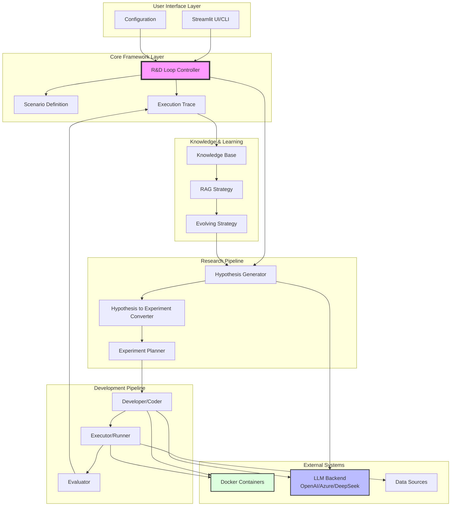

# High-Level Architecture

## Overview

RD-Agent is a comprehensive framework for automating data-driven research and development processes. The system follows a research-development loop paradigm where AI agents propose hypotheses, implement them as experiments, execute them, and learn from feedback.

## System Architecture Diagram

## Key Components

### 1. **Core Framework Layer**
- **Scenario**: Defines the problem domain and context (e.g., quantitative finance, medical prediction, Kaggle competitions)
- **Trace**: Maintains history of experiments, hypotheses, and feedback for learning
- **R&D Loop Controller**: Orchestrates the entire research-development cycle

### 2. **Research Pipeline (R - Research)**
- **Hypothesis Generator**: Proposes new ideas based on current knowledge and past feedback
- **Hypothesis to Experiment Converter**: Translates abstract hypotheses into concrete experiment plans
- **Experiment Planner**: Structures the implementation approach and task decomposition

### 3. **Development Pipeline (D - Development)**
- **Developer/Coder**: Implements experiment code using LLM-powered code generation
- **Executor/Runner**: Runs experiments in isolated environments (Docker)
- **Evaluator**: Assesses results and generates structured feedback

### 4. **Knowledge & Learning System**
- **Knowledge Base**: Stores accumulated knowledge from past experiments
- **RAG Strategy**: Retrieval-Augmented Generation for knowledge query
- **Evolving Strategy**: Improves system capabilities over iterations

### 5. **External Integration**
- **LLM Backend**: Supports multiple providers (OpenAI, Azure, DeepSeek, etc.) via LiteLLM
- **Docker Containers**: Isolated execution environments for experiments
- **Data Sources**: Domain-specific datasets (financial, medical, competition data)

## Data Flow

1. **Hypothesis Generation**: Based on scenario context and historical trace
2. **Experiment Planning**: Convert hypothesis into actionable experiment structure
3. **Code Implementation**: Generate implementation using LLM and templates
4. **Execution**: Run code in isolated Docker environment
5. **Evaluation**: Assess results and generate feedback
6. **Knowledge Update**: Store learnings in knowledge base
7. **Loop Iteration**: Use feedback to generate improved hypotheses

## Supported Scenarios

### Financial Domain
- **Factor Evolution**: Automated factor discovery and refinement
- **Model Evolution**: Iterative model architecture improvement
- **Joint Optimization**: Co-evolution of factors and models
- **Report Analysis**: Extract insights from financial reports

### Medical Domain
- **Prediction Models**: Automated medical prediction model development

### General Data Science
- **Kaggle Competitions**: Automated feature engineering and model tuning
- **MLE-Bench**: Machine learning engineering tasks
- **Paper Implementation**: Convert research papers into working code

## Design Principles

1. **Modularity**: Each component is independently replaceable
2. **Extensibility**: Easy to add new scenarios and strategies
3. **Automation**: Minimal human intervention in the R&D loop
4. **Learning**: Continuous improvement through feedback loops
5. **Isolation**: Safe execution in containerized environments
6. **Flexibility**: Support for multiple LLM backends and configurations

## Architecture Benefits

- **Parallel Execution**: Asynchronous R&D loop allows multiple experiments simultaneously
- **Knowledge Accumulation**: Learning from past experiments improves future performance
- **Scenario Agnostic**: Core framework works across different domains
- **Cost Effective**: Modular design allows selective use of expensive LLM calls
- **Reproducible**: Docker-based execution ensures consistent results
