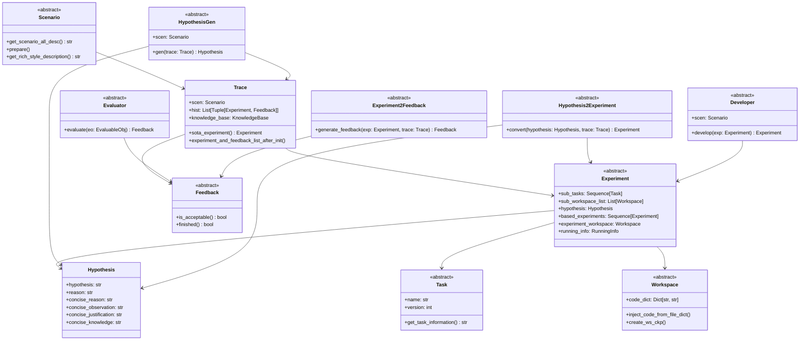
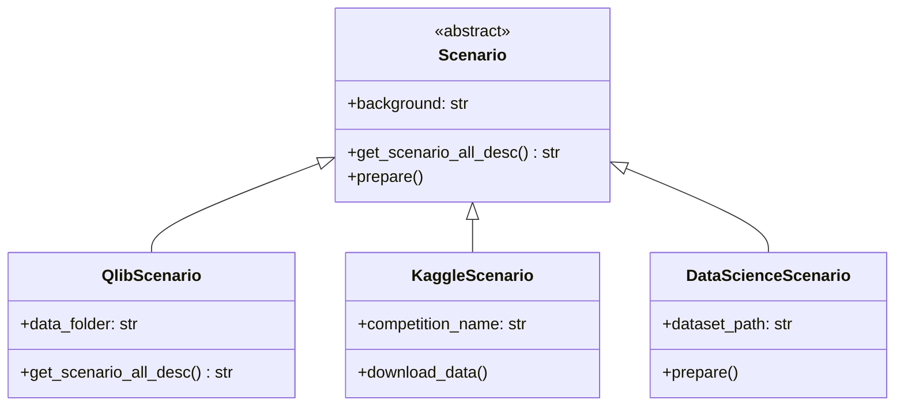
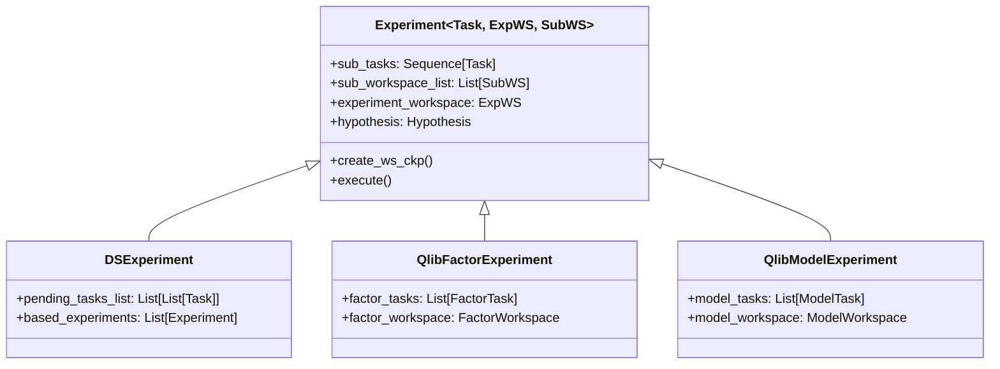
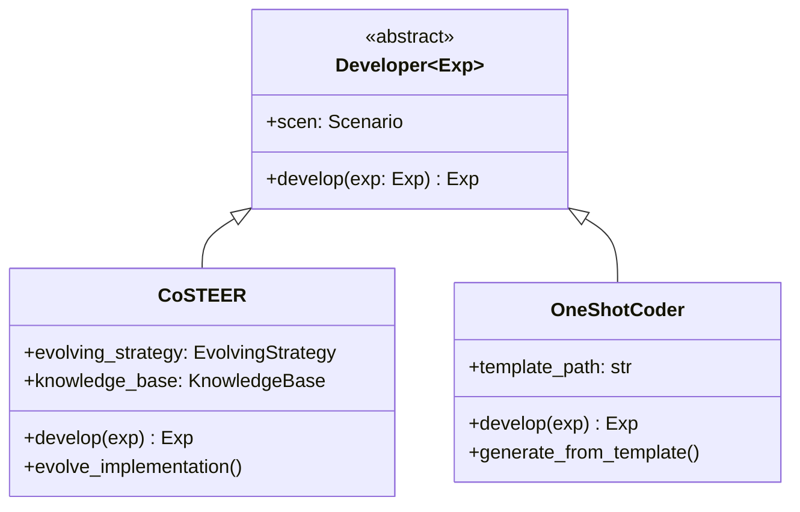
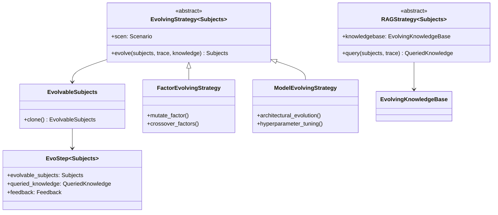
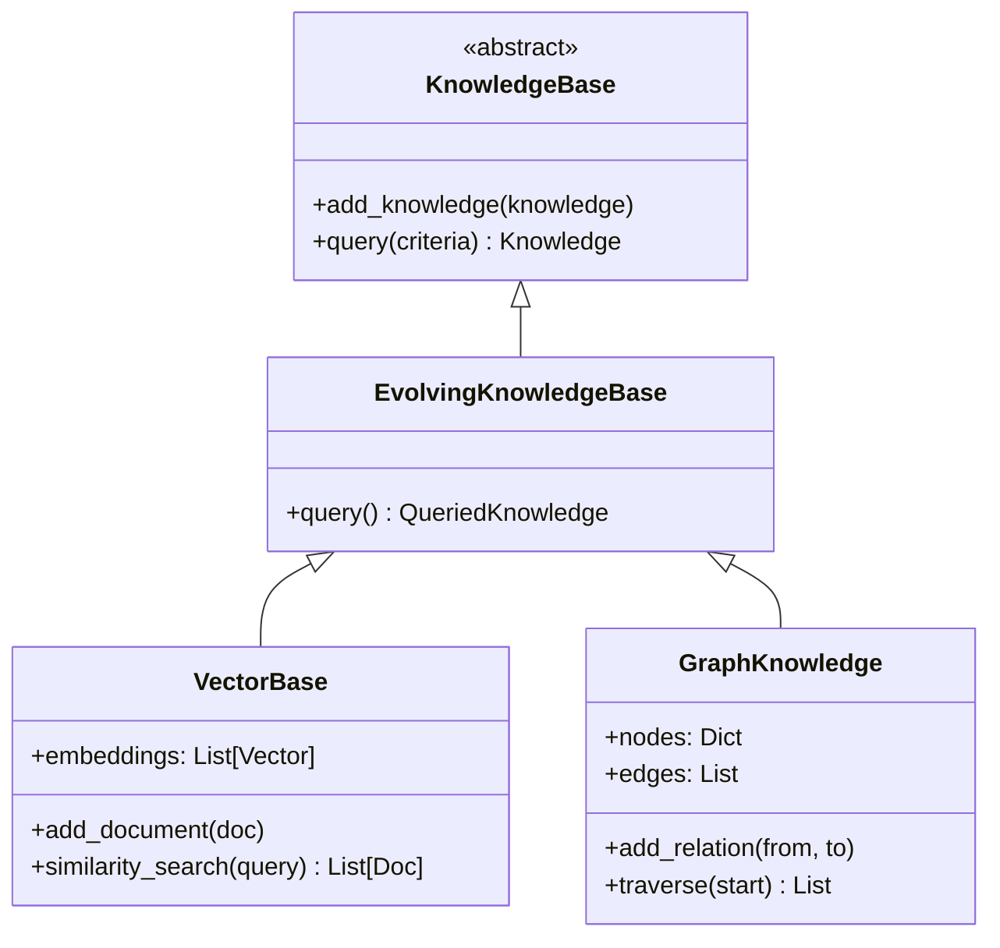

# Low-Level Design - Core Components

## Class Structure and Design Patterns

### Core Abstraction Hierarchy



## Key Design Patterns

### 1. Strategy Pattern
The framework extensively uses the Strategy pattern for pluggable components:

- **HypothesisGen**: Different strategies for hypothesis generation (Naive, Proposal-based)
- **Developer**: Different implementation strategies (CoSTEER, One-shot)
- **Evaluator**: Domain-specific evaluation strategies

### 2. Template Method Pattern
Abstract base classes define the workflow skeleton, with specific implementations in subclasses:

```python
# Example: Developer pattern
class Developer(ABC):
    def develop(self, exp: Experiment) -> Experiment:
        # Template method defining the development workflow
        pass
```

### 3. Observer Pattern
The Trace system observes and records all experiments and feedback:

```python
class Trace:
    hist: List[Tuple[Experiment, Feedback]]
    
    def record(self, experiment, feedback):
        self.hist.append((experiment, feedback))
```

## Component Details

### Core Framework Components

#### 1. Scenario Component


**Responsibilities:**
- Define domain-specific context
- Provide data access
- Configure evaluation metrics
- Manage environment setup

#### 2. Experiment Component


**Responsibilities:**
- Encapsulate experiment structure
- Manage task dependencies
- Store implementation code
- Track execution results

#### 3. Developer/Coder Component


**Responsibilities:**
- Generate implementation code
- Apply evolving strategies
- Manage code templates
- Handle error recovery

### Evolving Framework Components

#### 4. Evolving Strategy


**Responsibilities:**
- Define evolution operations (mutation, crossover)
- Query relevant knowledge
- Apply RAG for knowledge retrieval
- Track evolution history

#### 5. Knowledge Base Component


**Responsibilities:**
- Store experiment results
- Maintain code patterns
- Enable knowledge retrieval
- Support learning from history

## Workflow Execution

### R&D Loop Sequence
```mermaid
sequenceDiagram
    participant Loop as RDLoop
    participant HGen as HypothesisGen
    participant H2E as Hypothesis2Experiment
    participant Dev as Developer/Coder
    participant Run as Runner
    participant Eval as Evaluator
    participant Trace as Trace

    Loop->>HGen: gen(trace)
    HGen->>Trace: query history
    Trace-->>HGen: past experiments
    HGen-->>Loop: hypothesis
    
    Loop->>H2E: convert(hypothesis, trace)
    H2E-->>Loop: experiment
    
    Loop->>Dev: develop(experiment)
    Dev->>Dev: generate code
    Dev-->>Loop: implemented_exp
    
    Loop->>Run: develop(implemented_exp)
    Run->>Run: execute in Docker
    Run-->>Loop: executed_exp
    
    Loop->>Eval: generate_feedback(executed_exp)
    Eval-->>Loop: feedback
    
    Loop->>Trace: record(exp, feedback)
    Trace->>Trace: update knowledge
```

## Data Structures

### Task Structure
```python
class Task:
    name: str
    version: int
    description: str
    implementation: str
    
class FactorTask(Task):
    factor_name: str
    factor_description: str
    factor_formulation: str
    variables: List[str]
    
class ModelTask(Task):
    model_name: str
    architecture_description: str
    model_type: str
    hyperparameters: Dict
```

### Workspace Structure
```python
class Workspace:
    code_dict: Dict[str, str]  # filename -> code
    execution_path: Path
    
class FactorWorkspace(Workspace):
    factor_implementations: Dict[str, str]
    
class ModelWorkspace(Workspace):
    model_file: str
    config_file: str
    requirements: List[str]
```

### Feedback Structure
```python
class Feedback:
    observations: str
    
class HypothesisFeedback(Feedback):
    hypothesis_evaluation: str
    decision: bool
    reason: str
    new_hypothesis: str
    
class FactorFeedback(Feedback):
    factor_value: str
    execution_feedback: str
    code_feedback: str
```

## Extension Points

### Adding New Scenarios
1. Extend `Scenario` base class
2. Implement domain-specific data loading
3. Define evaluation metrics
4. Create scenario-specific tasks and workspaces

### Adding New Evolution Strategies
1. Extend `EvolvingStrategy`
2. Define evolution operators
3. Implement knowledge query logic
4. Configure RAG if needed

### Adding New LLM Backends
1. Configure LiteLLM provider
2. Set environment variables
3. Implement provider-specific handling if needed

## Performance Considerations

- **Async Execution**: R&D loop supports parallel hypothesis evaluation
- **Caching**: LLM responses and embeddings are cached
- **Incremental Learning**: Knowledge base updated incrementally
- **Resource Management**: Docker containers cleaned up after execution
