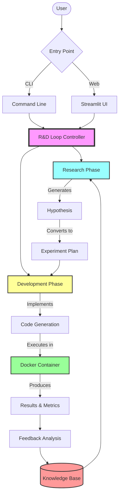
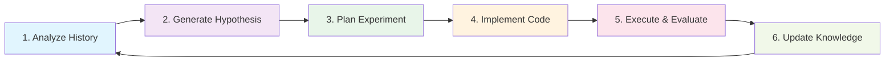
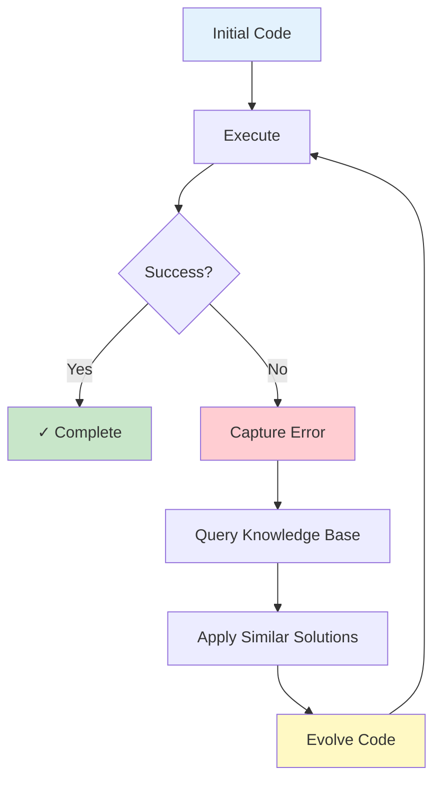
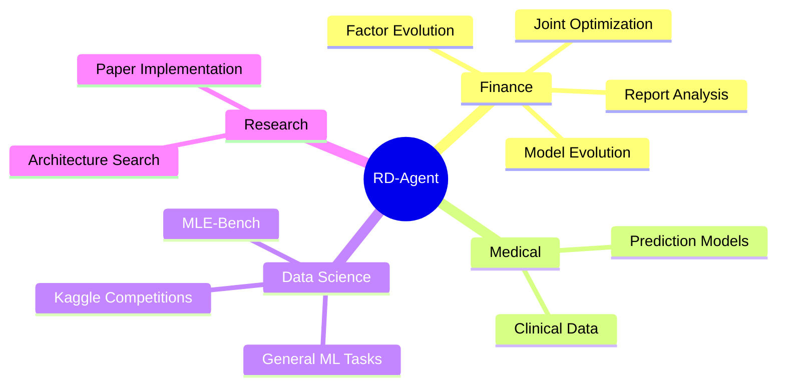
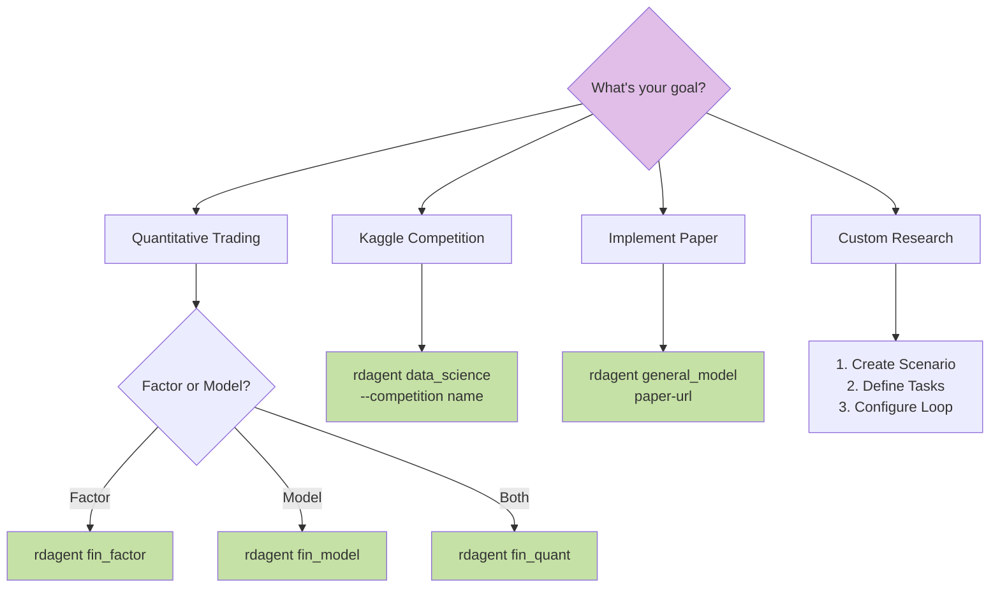

# RD-Agent Architecture Overview - Visual Summary

## Quick Reference Guide

This document provides a visual summary of the RD-Agent architecture, serving as a quick reference for developers and researchers.

## 🎯 What is RD-Agent?

RD-Agent is an **automated Research & Development framework** that uses AI agents to:
- Generate and test hypotheses
- Implement code solutions
- Execute experiments
- Learn from feedback

Think of it as an **AI scientist** that can autonomously conduct research and development in data-driven domains.

## 🏗️ System Architecture at a Glance



## 📊 Core Components Matrix

| Component | Purpose | Key Classes | When to Extend |
|-----------|---------|-------------|----------------|
| **Scenario** | Domain context | `Scenario`, `QlibScenario`, `KaggleScenario` | Adding new domain |
| **Hypothesis Gen** | Idea proposal | `HypothesisGen`, `DSProposalV2ExpGen` | New proposal strategy |
| **Developer** | Code implementation | `Developer`, `CoSTEER` | New coding approach |
| **Experiment** | Execution structure | `Experiment`, `DSExperiment` | New experiment type |
| **Evaluator** | Performance assessment | `Evaluator`, `Experiment2Feedback` | New evaluation metrics |
| **Knowledge Base** | Learning & memory | `KnowledgeBase`, `VectorBase` | New storage method |

## 🔄 The R&D Loop in 6 Steps



### Detailed Flow:

1. **Analyze History**: Query past experiments from knowledge base
2. **Generate Hypothesis**: AI proposes new research idea
3. **Plan Experiment**: Convert hypothesis to concrete tasks
4. **Implement Code**: Generate implementation using LLM + templates
5. **Execute & Evaluate**: Run in Docker, collect metrics
6. **Update Knowledge**: Store learnings for future iterations

## 🧩 CoSTEER: The Evolution Engine

CoSTEER (Collaborative Evolving Strategy with Error Recovery) is RD-Agent's secret sauce:



**Key Features:**
- ♻️ Multi-round refinement
- 🔍 Error-driven learning
- 📚 Knowledge-based evolution
- 🎯 Template + LLM hybrid

## 🆚 How RD-Agent Compares

### vs. AutoML (H2O, Auto-sklearn)
- ✅ RD-Agent: Full R&D loop with hypothesis generation
- ⚠️ AutoML: Hyperparameter search only

### vs. Code Agents (Copilot, CodeLlama)
- ✅ RD-Agent: Multi-round evolution with error recovery
- ⚠️ Code Agents: Single-shot generation

### vs. General Agents (AutoGPT, LangChain)
- ✅ RD-Agent: Scientific research focus, domain expertise
- ⚠️ General Agents: Broad but shallow capabilities

### vs. Research Tools (Semantic Scholar)
- ✅ RD-Agent: End-to-end implementation & verification
- ⚠️ Research Tools: Information retrieval only

## 🎨 Supported Scenarios



## 🔧 Extension Points

Want to customize RD-Agent? Here's where to start:

### 1. Add New Scenario
```python
class MyScenario(Scenario):
    def get_scenario_all_desc(self) -> str:
        return "My domain description"
    
    def prepare(self):
        # Setup data and environment
        pass
```

### 2. Create Custom Hypothesis Generator
```python
class MyHypothesisGen(HypothesisGen):
    def gen(self, trace: Trace) -> Hypothesis:
        # Your logic here
        return Hypothesis(...)
```

### 3. Implement New Developer Strategy
```python
class MyDeveloper(Developer):
    def develop(self, exp: Experiment) -> Experiment:
        # Your implementation
        return exp
```

## 📈 Performance Characteristics

| Metric | Value | Notes |
|--------|-------|-------|
| **MLE-Bench Score** | 30.22% | Best ML engineering agent |
| **ARR (Finance)** | 2× benchmark | With 70% fewer factors |
| **Parallelization** | ✅ Yes | Async hypothesis evaluation |
| **Docker Overhead** | ~2-5s | Container startup time |
| **LLM Cost** | Variable | Depends on model choice |

## 🚀 Quick Start Decision Tree



## 📚 Documentation Navigation

```
docs/
├── architecture/                    # 👈 You are here
│   ├── high_level_architecture.md  # System overview
│   ├── low_level_design.md         # Implementation details
│   ├── component_comparison.md     # Framework comparisons
│   └── README.md                   # Navigation guide
│
├── project_framework_introduction.rst  # Original framework docs
├── scens/                           # Scenario-specific guides
├── development.rst                  # Developer setup
└── api_reference.rst               # API documentation
```

## 🎯 Key Takeaways

1. **RD-Agent = R (Research) + D (Development)**
   - R: Hypothesis generation and planning
   - D: Code implementation and execution

2. **Unique Strengths**
   - Scientific research focus
   - Error-driven evolution (CoSTEER)
   - Real-world verification
   - Domain-specific optimization

3. **Best For**
   - ✅ Automated quantitative research
   - ✅ Data science automation
   - ✅ Research paper implementation
   - ❌ General web automation
   - ❌ Simple code completion

4. **Extensible by Design**
   - Strategy pattern for pluggable components
   - Template method for workflows
   - RAG for knowledge management

## 🔗 Quick Links

- [Full Architecture Docs](./README.md)
- [High-Level Architecture](./high_level_architecture.md)
- [Low-Level Design](./low_level_design.md)
- [Component Comparison](./component_comparison.md)
- [GitHub Repository](https://github.com/microsoft/RD-Agent)
- [Documentation](https://rdagent.readthedocs.io/)

---

**Remember**: RD-Agent is not just a code generator—it's an automated scientist that can propose, implement, and validate research ideas autonomously.
